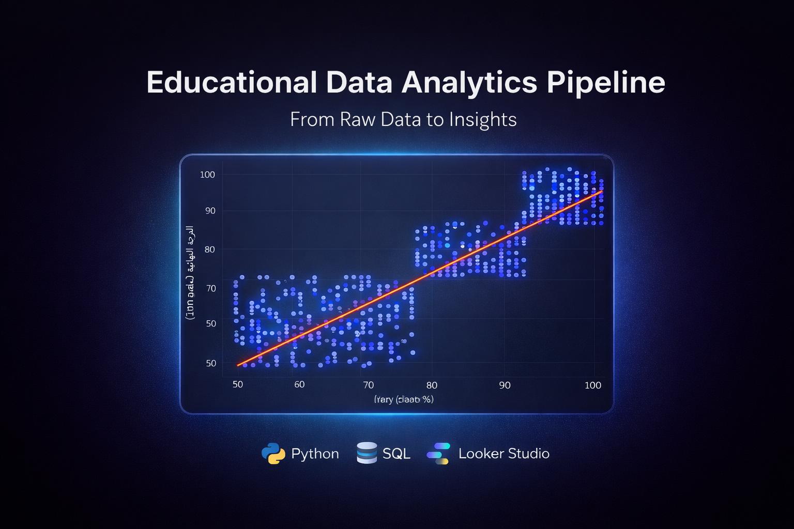

# 📊 Educational-Data-Analytic-Pipeline  🎓
نظام متكامل لتحليل الأداء التعليمي باستخدام Python و Looker Studio لـ 600 سجل بيانات
### *Dynamic Data Processing & Interactive Visualization System*

---

## 📝 وصف المشروع (Project Overview)
نظام متكامل لتحليل البيانات التعليمية يقوم بتحويل البيانات الخام من **Google Sheets** إلى رؤى استراتيجية تفاعلية. يتميز النظام ببيئة عمل **ديناميكية** تكتشف حجم البيانات تلقائياً وتجري تحليلات إحصائية متقدمة باستخدام **Python**.

## 🚀 المميزات التقنية (Technical Features)
*   **Dynamic Ingestion:** كود Python مرن يتعرف على عدد السجلات تلقائياً (Dynamic Row Detection).
*   **Statistical Analysis:** حساب معامل ارتباط "بيرسون" بين الحضور والتحصيل الدراسي.
*   **Live Dashboards:** لوحات تحكم تفاعلية في Looker Studio مرتبطة لحظياً بمصدر البيانات.
*   **Data Cleaning:** معالجة تلقائية للبيانات النصية وتحويلها إلى قيم رقمية قابلة للتحليل.

## 🛠️ الأدوات المستخدمة (Tech Stack)
*   **Language:** Python (Pandas, Seaborn, Matplotlib).
*   **Database:** SQL (Data Structuring & Querying).
*   **Platform:** Google Cloud (Sheets API, Looker Studio, Colab).
*   **Web:** Google Sites (Portfolio Hosting).

## 📂 هيكلية المشروع (File Structure)
*   `analysis.ipynb`: دفتر ملاحظات Colab للتحليل الإحصائي الديناميكي.
*   `queries.sql`: استعلامات SQL المستخدمة لتهيئة وتصفية البيانات.
*   `README.md`: وثائق المشروع الحالية.

## 📊 النتائج الرئيسية (Key Insights)
> "كشف التحليل عن ارتباط طردي قوي (Correlation > 0.8) بين نسبة الحضور والدرجات النهائية، مما سمح ببناء نموذج تنبؤي للطلاب المعرضين لخطر التعثر."

---
📩 **للتواصل والاستفسار:**
يمكنكم زيارة معرض أعمالي الكامل عبر الرابط: [Google Sites]
